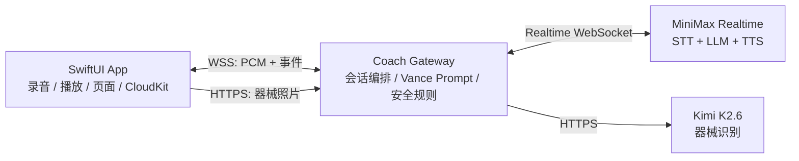

# Vance 实时语音模块：SwiftUI 合并交接

## 一句话结论

把本仓库部署成一个无 UI 的 **Coach Gateway**。SwiftUI 负责录音、播放、页面、登录和 CloudKit；Gateway 负责 MiniMax 实时代理、Vance 人格提示词、Kimi 器械识别，以及所有供应商 API Key。

## 核心能力（当前可交付）

1. **实时语音陪练与 Vance Soul**：MiniMax 驱动中文语音转写、思考和音色输出；Vance 的人格、安全边界、减脂日/训练中引导和情绪支持都由同一份版本化 Prompt 控制。回复以“一个当前最优先动作”为单位，而不是长篇计划。
2. **健身房器械识别**：Kimi K2.6 根据用户照片识别器械，只返回高置信设备；medium 仅请求确认，low 完全丢弃。识别结果进入实时会话作为环境事实，语音教练再结合上下文决定建议。
3. **语音体验质量与安全**：24kHz PCM 实时通道、端侧 VAD 噪声校准/短杂音过滤、空音频双重拦截和自动重连；本地会话转写、时延、人工标注可用于黑客松评估与 Prompt 回归。

当前不作为能力承诺：完整自动训练计划、可穿戴设备数据联动、正式云端记忆、自动接入动作资料库。动作资料库已准备但尚未接入教练链路。



## 1. SwiftUI 如何接入

### 端与后端的职责

| SwiftUI / CloudKit | Coach Gateway |
| --- | --- |
| 麦克风权限、PCM 采集、语音播放、聊天 UI | MiniMax WebSocket 代理与重连 |
| 本地会话、用户偏好、训练总结（可同步 CloudKit） | Vance 人格与安全提示词的唯一来源 |
| 拍照、显示识别状态和结果 | Kimi 图片识别、high/medium/low 过滤 |
| 用户身份 Token | 供应商 Key、限流、会话审计（可选） |

CloudKit **不**承担实时音频中转，也不保存 `MINIMAX_API_KEY` / `KIMI_API_KEY`。原始音频默认不持久化；如需历史，只保存转写、摘要和用户显式确认的训练记录。

### 最小接入流程

1. App 创建一个 UUID `conversationId`，本地和 CloudKit 都用它关联会话。
2. App 建立 `wss://<gateway>/realtime?conversationId=<UUID>`。
3. App 以 24 kHz、单声道、signed 16-bit little-endian PCM 采集语音；每块 Base64 后通过 WebSocket 发送。
4. 手动模式在松手后只在至少收到一个音频块时提交；自动聆听模式先做环境噪声校准，只提交持续人声，并过滤短促杂音。两种模式都等待文本增量和 PCM 音频增量，并按顺序播放。
5. App 拍照时调用识别 REST API；展示高置信器械，然后把结果作为上下文交给同一条实时会话。语音教练决定下一步，不由视觉接口生成训练计划。

### 当前已可复用的实时事件（兼容现有实现）

客户端发送：

```json
{"type":"session.update","session":{"modalities":["text","audio"],"voice":"male-qn-jingying","input_audio_format":"pcm16","output_audio_format":"pcm16"}}
{"type":"input_audio_buffer.clear"}
{"type":"input_audio_buffer.append","audio":"<24kHz mono PCM16 的 Base64>"}
{"type":"input_audio_buffer.commit"}
{"type":"conversation.item.create","item":{"type":"message","role":"user","status":"completed","content":[{"type":"input_text","text":"今天练腿，30 分钟"}]}}
{"type":"response.create","response":{"modalities":["audio","text"],"voice":"male-qn-jingying"}}
```

客户端接收并处理：`session.updated`、`input_audio_buffer.committed`、`conversation.item.created`（含转写）、`response.text.delta` / `response.audio_transcript.delta`、`response.audio.delta`、`response.done`、`error`。

> 语音保护：空音频 commit 已在端和服务端双重拦截；一旦收到 `input_audio` 相关错误，App 应断开并重连该实时连接，不能在已报错的上游会话上继续 append。

### 自动聆听（VAD）参数

当前 Web demo 已有本地 VAD，SwiftUI 可以按同一策略实现：先校准 1.8 秒环境噪声，以噪声中位数为基线；默认“严格”阈值是 **基线 +18 dB**（可选 +12 / +24 dB）；持续 260 ms 超阈值才开始，持续 850 ms 静音才结束，累计人声少于 550 ms 直接丢弃，并保留开始前 300 ms 的 pre-roll。

VAD 只是在端上决定何时发送 PCM，不替代 MiniMax 的转写。Gateway 会记录 `client.vad` 的校准、开始、丢弃和提交指标，方便黑客松现场排查；不要上传原始音频用于校准。

### 推荐的合并小改造

当前 demo 由 Web 客户端发送完整 `session.update`。合并前应把协议收敛为：

```json
{"type":"vance.session.configure","voiceId":"male-qn-jingying"}
```

Gateway 在服务端注入固定的 Vance Prompt、音频格式和安全规则，再转换为 MiniMax 的 `session.update`。这样 SwiftUI 不需要携带或暴露提示词，也无法被客户端篡改。

## 2. 无 UI 模块如何开放

建议把 Web 的 `public/` 目录视为 demo，不交付给队友；交付以下后端契约和文件：

| 模块 | 交付物 | 当前状态 |
| --- | --- | --- |
| Realtime Gateway | `GET /realtime` WebSocket | 已实现，当前是 MiniMax 事件透传 |
| 视觉识别 | `POST /api/gym-vision` | 已实现，只返回器械，不返回训练计划 |
| 人格 / Soul | `Vance Prompt v1` + `voiceId` 白名单 | 已实现，但 Prompt 仍内嵌在 `public/index.html`，合并前应移入服务端常量 |
| 评估与留存 | 本地 SQLite 模型与时序字段 | 仅开发评估用途，不建议直接对 App 公开 |
| 动作资料库 | `exercise-catalog.mjs` | 已准备，**尚未接入实时教练链路**，不能作为当前能力承诺 |

### 视觉识别 API

`POST /api/gym-vision`

```json
{
  "conversationId": "UUID",
  "imageData": "data:image/jpeg;base64,...",
  "goal": "减脂",
  "userPlan": "今天只有 30 分钟"
}
```

```json
{
  "id": "UUID",
  "sceneSummary": "器械区可确认哑铃架与长凳",
  "equipment": [
    {"name":"哑铃架与哑铃","confidence":"high","visibleEvidence":"可见多层哑铃架和成对哑铃"}
  ],
  "needsConfirmation": ["疑似史密斯机：画面遮挡，请确认"]
}
```

规则：`high` 才进入 `equipment`；`medium` 仅在 `needsConfirmation`；`low` 被丢弃。App 不应根据视觉结果自行拼训练计划，而应发送一条包含“已确认器械 + 用户当前目标”的文本上下文给实时会话。

### Prompt / Soul 资产

Vance v1 的核心约束：

- 中文健身陪练；热情、务实、不施压。
- 每轮 1–3 句，只给一个当前最优先动作或决定。
- 优先级：安全、动作质量、训练量、训练强度。
- 疼痛、头晕、胸闷、异常呼吸：立刻停止并寻求专业帮助；不做诊断。
- 不伪造完成记录；用户疲劳时允许减量、延长休息或降低难度。
- 器械图只提供环境事实，训练决策由语音教练结合上下文作出。

建议在 Gateway 中固化为版本化常量，例如 `VANCE_PROMPT_VERSION=v1`；每次会话和评估样本记录该版本，方便队友迭代人格时回归比较。

## 3. Key 与部署交付

交给队友的是 **密钥名、部署位置和访问权限**，不是把真实 Key 写进 SwiftUI、Git、CloudKit 或 Markdown。

| Secret / 配置 | 位置 | 用途 |
| --- | --- | --- |
| `MINIMAX_API_KEY` | Gateway 的部署环境变量 / Secret Manager | MiniMax Realtime 上游鉴权 |
| `KIMI_API_KEY` | Gateway 的部署环境变量 / Secret Manager | Kimi K2.6 器械识别 |
| `PORT` | Gateway 环境变量 | 服务监听端口 |
| `voiceId` | App 可配置，非 secret | MVP 可用 `male-qn-jingying`、`Chinese (Mandarin)_News_Anchor` |

真实 Key 应通过团队的 Secret Manager 或一次性私密渠道共享，并在交接后由密钥所有者轮换；不要把本机 `.env` 文件一起合并或上传。

生产 Gateway 必须提供 HTTPS/WSS、App 用户鉴权和基础限流。当前 demo 仅监听 `127.0.0.1`、没有鉴权 / 限流，且 README 标注所用 MiniMax Realtime 路径为旧版接口；部署前需要用团队 Key 做一次 MiniMax 当前接口兼容性验证。

## 4. 推荐合并包

交付给队友：

1. `server.mjs`：Realtime Proxy + Kimi REST 路由（合并前将 Prompt 移出 UI）。
2. `gym-vision.mjs`：图片输入校验、Kimi 请求、置信度过滤。
3. `store.mjs`：仅供开发评估参考；正式 App 的用户记录由 SwiftData / CloudKit 接管。
4. 本文档、`.env.example`、以及一份 Vance Prompt v1 文本。

不交付：`public/` 内的 Web UI、真实 `.env`、`data/` 中的 SQLite / 图片 / 日志、任何真实用户图片或语音。

## 当前风险清单

- VAD 当前是浏览器参考实现，已采用“环境基线 +18 dB”的严格默认值；不同 iPhone、耳机和健身房噪声仍需要用 3–5 段真实样本校准后再冻结为 App 默认值。
- Gateway 现在是手写 WebSocket 代理，黑客松可用；若转正式产品，建议替换成成熟 WebSocket 服务并加入鉴权、限流和结构化错误码。
- 图片识别当前会落服务器本地文件；若坚持 local-first，应改成识别后立即删除，或由 App 端决定是否把原图保存在私有 CloudKit。
