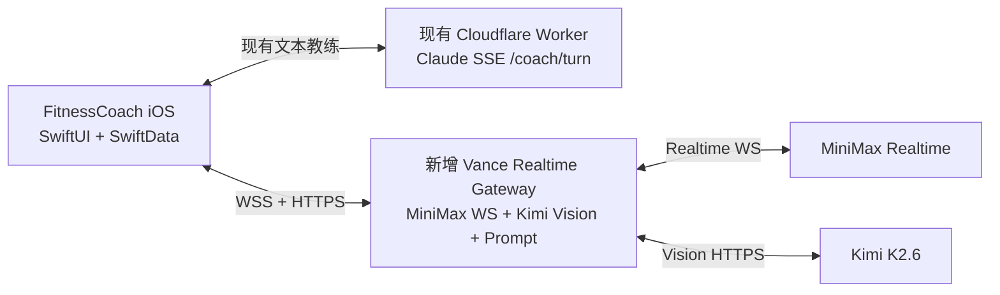

# Vance 实时语音模块合并方案

> 基线：`main` @ `7bd9151`（2026-08-02 本地拉取）。本分支已实现 Gateway 与 iOS 网络接入骨架；不替换现有 SwiftUI 页面或训练状态机。

## 结论

现有项目已经有两条清晰的链路：

- iOS：SwiftData 本地存储、`CoachThread`、`SpeechRecognizer`、`CoachAPI`。
- Cloudflare Worker：Claude 的 SSE 文本教练，`/coach/turn`。

Vance 应作为**独立的 Realtime Gateway 服务**接入，而不是将现有 `server.mjs` 直接塞进 Cloudflare Worker。原因是它需要长连接 WebSocket 代理与服务端供应商密钥；本次 Node MVP 不应原样运行在现有 Worker 路径中。



黑客松阶段保持 Worker 不变：文本输入继续可走 Claude SSE；用户点“实时语音”时切换到 Vance Gateway。这样不打断既有 UI、SwiftData、工具调用和测试。

## 核心能力（交付范围）

1. **实时语音陪练与 Vance Soul**：MiniMax 完成中文转写、实时文本与音色输出；Vance Prompt 控制减脂日、训练中引导、情绪支持和安全边界。每轮只给一个当前最优先动作。
2. **器械图片识别**：首页对话输入栏已提供上传入口和识别中状态。Kimi K2.6 只识别高置信器械；`medium` 要求确认；`low` 丢弃。图片模块不产出训练计划，已确认设备会写入下一轮 Vance 上下文，由语音教练接力。
3. **语音质量与安全**：24kHz PCM 通道、端侧按住说话、空音频双重拦截和上游断连处理。Web 原型的噪声校准/VAD 参数作为下一步真机校准输入，尚未在 Swift 客户端自动启用。

不作为本次合并承诺：完整自动日计划、Apple Health、CloudKit 同步、动作资料库自动检索。现有项目当前是 **SwiftData 本地存储**，尚未接入 CloudKit。

## 文件归属与合并映射

| 来源模块 | 合入 / 新建位置 | 用途 | 备注 |
| --- | --- | --- | --- |
| `server.mjs` | `vance-gateway/server.mjs` | MiniMax WS 代理、Kimi REST | 已新增；不放入 `worker/src/` |
| `gym-vision.mjs` | `vance-gateway/` | Kimi 请求、8MB 校验、置信度过滤 | 保留服务端 Key |
| 评估记录 | 暂不默认接入 | 开发期评估与时延记录 | 本次 Gateway 默认不落盘；App 用户数据仍以 SwiftData 为准 |
| Vance Prompt | `vance-gateway/coach-prompt.mjs` | 人格、安全与风格版本 | 已服务端化，版本 `v1` |
| `RealtimeCoachClient.swift` | `FitnessCoach/Networking/` | WebSocket、PCM 播放、事件转译 | 已新增；不复用 SSE 的 `CoachAPI` |
| `VanceGateway.swift` | `FitnessCoach/Networking/` | Gateway 配置与 Kimi REST 客户端 | 已新增 |
| `HomeView.swift` | 小改 | 同一对话流的器械图上传入口与加载态 | 已接入，不新增独立页面 |
| `CoachThread.swift` | 小改 | Realtime transport、识别回显与上下文注入 | 已接入，保留 SSE fallback |

不要合入：来源仓库的 `public/` Web UI、`.env`、`data/`、`logs/`、图片/录音样本和压缩包。

## iOS 接入点

### 1. 保留现有文本路径

`CoachAPI.swift` 和 `/coach/turn` 的 SSE 协议不改。它继续承担文本输入、Claude tool calls 与离线 scripted fallback。

### 2. 新增实时语音路径

新增 `RealtimeCoachClient`，连接：

```
wss://<VANCE_REALTIME_HOST>/realtime?conversationId=<UUID>
```

它负责：

- 将 `AVAudioEngine` 的缓冲转为 24kHz、mono、PCM16 little-endian，再 Base64 发送；
- 顺序播放 `response.audio.delta` 的 PCM；
- 将 `response.audio_transcript.delta` / `response.text.delta` 显示为同一条增长中的 `ChatMessage`；
- 处理 `response.done` 和 `error`；遇到 `input_audio` 错误必须关闭并重建连接。

不要让同一段话同时经过 `SpeechRecognizer`（Apple STT → Claude）和 MiniMax（音频 → Vance）；实时模式启用时暂停 `SpeechRecognizer`，否则会出现重复回复。

### 3. 语音状态映射

现有 `VoiceState` 可以直接复用：

| 现有状态 | Vance 事件 |
| --- | --- |
| `.listening` | 当前为按住说话并收集音频；后续可映射为 VAD 校准 / 收集音频 |
| `.processing` | `input_audio_buffer.commit` 后等待转写 |
| `.speaking` | 首个文本或音频增量到达 |
| `.idle` | `response.done`、错误或用户取消 |

后续真机自动聆听建议从这些参数开始校准：1.8 秒噪声校准、基线 +18dB、260ms 连续人声开始、850ms 静音结束、550ms 最短人声、300ms pre-roll。当前版本保留按住说话，避免环境噪声误发。

## Gateway 协议

### 实时 WebSocket

当前 Gateway 透传 MiniMax Realtime 事件。App 最小发送序列：

```json
{"type":"session.update","session":{"modalities":["text","audio"],"voice":"male-qn-jingying","input_audio_format":"pcm16","output_audio_format":"pcm16"}}
{"type":"input_audio_buffer.clear"}
{"type":"input_audio_buffer.append","audio":"<PCM16 Base64>"}
{"type":"input_audio_buffer.commit"}
{"type":"response.create","response":{"modalities":["audio","text"],"voice":"male-qn-jingying"}}
```

合并前将此协议收敛为 `vance.session.configure`：iOS 只发送 `voiceId` 和用户上下文，Gateway 注入 Vance Prompt、音频格式和安全规则。Prompt 不应再放在客户端，防止被篡改或随着 App 包暴露。

### 器械识别 REST

`POST https://<VANCE_REALTIME_HOST>/api/gym-vision`

```json
{
  "conversationId": "UUID",
  "imageData": "data:image/jpeg;base64,...",
  "goal": "减脂",
  "userPlan": "今天只有 30 分钟"
}
```

响应只包含 `sceneSummary`、`equipment[]`（仅 `high`）和 `needsConfirmation[]`。App 将已确认器械 + 当前训练状态发回实时会话；不要在 App 或视觉接口里先写训练计划。

## Secret 与配置

### Gateway 部署 Secret

| 名称 | 用途 |
| --- | --- |
| `MINIMAX_API_KEY` | MiniMax Realtime 上游鉴权 |
| `KIMI_API_KEY` | Kimi K2.6 器械识别 |
| `VANCE_GATEWAY_SHARED_SECRET` | 黑客松期 App → Gateway Bearer 鉴权 |

### iOS 配置

在 `Secrets.xcconfig` 新增（只放主机和短期 Gateway Token，不放供应商 Key）：

```xcconfig
VANCE_REALTIME_HOST = vance-gateway.your-domain.com
VANCE_GATEWAY_SHARED_SECRET = replace-at-build-time
```

并在 `project.yml` 的 `info.properties` 增加对应 `VANCE_*` 字段。当前的 `COACH_SHARED_SECRET` 已在 App 包内，适合作为黑客松防滥用门槛，但不是正式用户鉴权；正式版本应改为每位用户的登录 Token。

真实 `MINIMAX_API_KEY` / `KIMI_API_KEY` 只在部署平台 Secret Manager 配置，不进入 Git、`Secrets.xcconfig`、CloudKit、iOS 二进制或本文件。

## 推荐合并顺序

1. Gateway、Vance Prompt v1、`RealtimeCoachClient`、`GymVisionAPI` 与 `CoachThread` Realtime 分支已加入本地代码。
2. 在 `vance-gateway/.env` 填入真实 MiniMax Key，启动服务，并完成“按住说话”真机端到端通路。
3. 在 iOS 的未追踪 `Secrets.xcconfig` 填入 Gateway 主机和临时 Gateway Token；生产环境改为 HTTPS/WSS。
4. 在首页上传一张器械照片：Kimi 回显的内容只能是高置信设备；再用语音询问下一步，确认 Vance 能结合该设备继续。
5. 用真机在安静/跑步机/团课音乐三种环境校准并接入 VAD；记录误触发、漏检、首字/首音时延。

## 验收标准

- 语音：连续说两轮，不出现空音频或“audio input must be latest”错误。
- 人格：减脂日、疲劳/不想练、疼痛三类输入均遵守 Vance 的“短、具体、不施压、安全优先”。
- 视觉：low 不显示；high 器械进入语音上下文；视觉回复不包含训练计划。
- 数据：原始音频不落盘；SwiftData 仍保存用户资料、训练记录和长期记忆；Gateway 默认不保存识别或对话数据。若后续加评估记录，须做最小化、脱敏并明确开关。
- 安全：供应商 Key 不存在于仓库、Xcode 配置、UI 测试输出或 App 包。
